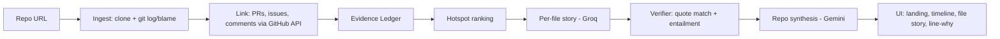

# Code Archaeologist — Problem Statement Analysis

> **Tagline:** *git blame tells you who. Code Archaeologist tells you why, with receipts.*
>
> **Document purpose:** Full-context briefing for humans and AI coding agents working on this project. Read Section 0 first. Sections 1–12 follow the requested outline. Appendices hold agent-facing specs (data model, prompts, open questions, glossary).
>
> **Document status:** Concept and pitch stage. **No code exists yet.** Everything marked "must build" is a plan, not a fact about the repo.

---

## 0. Orientation for AI agents (read first)

### 0.1 What we are operating on

We are building **Code Archaeologist**, a web app for a **24-hour hackathon**. A user pastes a GitHub repository URL. The app reconstructs *why* the code looks the way it does by correlating current code with its git history: commits, pull requests, issues, and review discussion. It produces:

- a **story per file** (chronological narrative of how and why the file reached its current form),
- a **repo timeline** (major shifts across the codebase),
- **click-a-line → why** (any line links to the change that introduced it and the discussion around it),
- with **every claim linked to evidence** and labeled with a **confidence tier**.

### 0.2 Current state

| Item | State |
|---|---|
| Idea | Chosen from two candidates. The other candidate ("What If" Simulator for News) was rated ~4/10 and is **out of scope** here. |
| Written artifacts | One-paragraph idea, a problem statement, a solution and trust write-up (analyzed in Section 1). |
| Code | None. |
| Team size, hackathon name, deadline, judging criteria | **Unknown.** See Appendix B (open questions). Confirm with the human before assuming. |
| Original stack idea | GitHub API + Groq (fast per-file analysis) + Gemini (whole-repo synthesis). |
| Original time estimate | "~10 hrs". **Treat as unrealistic.** Realistic core build is **16–18 hrs**; see Section 11. |
| Frontend direction (decided) | React with a popular framework (recommendation: Next.js + TypeScript + Tailwind). Extra tech as necessary. |

### 0.3 Non-negotiable product principles

These come from the pitch. Breaking them breaks the product's only real differentiator.

1. **Evidence or silence.** Every displayed claim must cite evidence (commit, PR, issue, or comment). If there is no evidence, the UI says "no recorded reason found" and does not speculate.
2. **Never claim what we don't ship.** The pitch makes explicit trust claims (Section 1.5). If a claim is not implemented and tested, remove it from the copy.
3. **Determinism over model self-report.** Confidence tiers and quote checks are computed by code, not by asking the LLM "how sure are you?".
4. **Read-only.** The tool never writes to a repository.
5. **Demo cannot depend on live APIs.** Pre-computed results for demo repos are mandatory. Live mode is a bonus.

### 0.4 Collaboration conventions

- The human collaborator prefers **terse communication and working output first**; skip long preambles in chat.
- Design and accessibility quality bar is **high** (see Section 7.1). Do not ship placeholder-grade UI.
- Keep the traceability matrix in Section 1.5 updated as features land.
- When a decision is missing, list the assumption you made in the PR/commit message and in a `DECISIONS.md` file.

---

## 1. Deep analysis of the problem statement and solution

### 1.1 The project in plain language

Every mature codebase has code that looks wrong but exists for a reason: an odd null check, a duplicate function, a hardcoded delay. The reason is rarely in the file. It lives in a commit from years ago, a PR discussion, or a bug report, and the people who knew it may have left. Developers who can't find the reason either **delete the code and break something** or **leave it alone out of fear** (a *Chesterton's Fence* problem: don't remove a fence until you know why it was built).

Code Archaeologist automates the digging. It gathers the history, links it to the current code, asks an LLM to write a narrative **constrained to the gathered evidence**, verifies that the narrative is actually supported by that evidence, and presents it with receipts.

### 1.2 How the written pitch evolved from the original idea

| Aspect | Original idea text | Current pitch text | Analysis |
|---|---|---|---|
| Differentiation | "Everyone does code explanation. Nobody does historical reasoning." | "git blame tells you who. Code Archaeologist tells you why, with receipts." | The "nobody" claim is **false or at least unverifiable**: AI coding assistants can run `git log`/`git blame` ad hoc, and history-mining tools exist (Section 4). The current pitch wisely drops "nobody" and differentiates on **evidence-linked, verified, whole-repo narrative**. Keep it that way. |
| Trust | Not addressed | Six explicit trust mechanisms | Big improvement, but each mechanism is a **promise that must be built** (Section 1.5). |
| Limits | Not addressed | Explicit "Known limits" | Good. Honest limits raise credibility with technical judges. |
| Time | ~10 hrs | Not stated | Original is optimistic; plan for 16–18 hrs. |
| Stack | GitHub API + Groq + Gemini | Same, described by role | Reasonable. Recommendation: use **local `git`** for history and the GitHub API only for PR/issue text (Section 6.4). |

### 1.3 Claim-by-claim review of the problem statement

| # | Claim in the problem statement | Evidence status | Risk | Recommended handling |
|---|---|---|---|---|
| 1 | "The reason lives outside the file, in a commit, PR discussion, or bug report; the people who knew it have often left." | Widely recognized in practice; not backed by a cited study in the text. | Low. | Keep. Optionally anchor with one **real example mined from a demo repo** (Section 8, "Fence incidents"). |
| 2 | Developers spend about 58% of their time on program comprehension (Xia et al., IEEE TSE, 2018; 78 professionals, 3,148 working hours). | **Verified** against the paper's abstract. | **Framing risk:** the statistic measures *program comprehension in general* (navigating, reading, inspecting), **not** time spent answering "why is this code here?" | Keep the statistic, but do not imply it measures "why" questions. |
| 3 | "Current tools don't answer the hardest question in that work, which is why the code is this way." | **Assertion, not evidence.** "Hardest" is unsupported. | Medium: a sharp judge will challenge it. | Reword: "Current tools rarely answer *why the code is this way*, a question that often requires reading commits, PRs, and issues by hand." |
| 4 | "`git blame` shows who and when, not why." | Accurate at the level of what blame outputs. | Low. | Keep. (Blame gives the commit; the commit message *may* contain a reason.) |
| 5 | "Commit messages are terse, and the real reasoning sits in PRs, issues, and review threads." | Commonly true but **varies widely by repo**. | Medium: this is also the **project's core risk** (junk messages produce weak evidence). | Keep, but pair with the honest limit that sparse-history repos produce low-confidence output. |
| 6 | "AI code explainers read only the current snapshot ... can't tell a deliberate workaround from a mistake." | **Overgeneralized.** Some AI tools can access repo context and run git commands. | Medium-high: easy to falsify in Q&A. | Reword: "Most AI code explainers focus on what the code does today; they don't typically provide evidence-linked reasoning about how it got there." Also verify current competitor features before the pitch (Section 4.3). |
| 7 | "Developers either delete load-bearing fixes ... or leave dead code alone because they're afraid." | Plausible, uncited. | Medium: no data. | Add one real, verifiable example from a demo repo, or present as "a familiar failure mode" without numbers. |

### 1.4 The solution, stage by stage

| Stage | Input | Output | Primary failure modes | Mitigation |
|---|---|---|---|---|
| 1. Collect history | Repo URL | Per-file commit history (with renames), line-level blame, linked PRs/issues/comments | API rate limits; huge repos; shallow clones; squash merges hide detail | Use local `git` for log/blame; API only for PR/issue text; cap scope; dedupe PR fetches; batch via GraphQL |
| 2. Scope to hotspots | Full history | Top-N files worth analyzing | Ranking picks generated/boring files | Ignore lockfiles, vendored, minified, generated; weight recency and evidence richness |
| 3. Reason with evidence | Evidence pack per file | Claims with evidence IDs (fast model), then repo-level synthesis (long-context model) | Hallucinated motives; token overflow; model ignores schema | Strict JSON schema; "no evidence" is a valid output; evidence packing under a token budget |
| 4. Verify | Claims + cited evidence text | Verified/downgraded/removed claims | Verifier is itself an LLM and can be wrong | Deterministic **verbatim-quote check first**; LLM entailment second; log both |
| 5. Present | Verified claims | Landing page, timeline, file story, click-line-why, evidence drawer | Overclaiming in UI copy; confusing confidence display | Confidence badges with text + icon; explicit limits banner |

**Key insight:** the hard part is **evidence retrieval and linking**, not prose generation. If evidence is missing, no prompt can rescue the output. Engineering time should skew toward the pipeline and verification, and UI polish should skew toward making evidence easy to inspect.

### 1.5 Trust-claim traceability matrix (must stay in sync with the code)

Each trust claim in the pitch must map to something concrete. If the "must exist" column is not satisfied, delete the claim from the copy.

| Pitch claim | What must exist in the codebase | How to test it | MVP? |
|---|---|---|---|
| Receipts on every claim | `Claim.evidenceIds` is required and non-empty for any claim not marked `none`; UI renders each as a link to the source URL | Unit test: schema rejects a claim without evidence; e2e: click evidence link opens correct URL | **Yes** |
| Stated vs. inferred | `Claim.kind: 'stated' \| 'inferred'`, shown as a visible label | Test: a claim derived only from a diff is never `stated` (enforced by rule + verifier) | **Yes** |
| Confidence tiers (high/medium/low/none) | `computeConfidence()` pure function based on evidence type, text quality, and verification result (**not** LLM self-report) | Table-driven unit tests over evidence fixtures | **Yes** |
| "No evidence: it says so" | Claims/regions with no usable evidence render "No recorded reason found" | Fixture file with only junk commits → all `none` | **Yes** |
| Verification pass | (a) Deterministic check that `quote` appears verbatim in cited evidence; (b) LLM entailment check; failures downgraded/removed | Fixture with a planted false claim → removed | **Yes** (at least (a)) |
| Read-only | No write scopes requested; no code paths that push/comment | Code review + token-scope check | **Yes** |
| "Access tokens are not stored" | Tokens held in memory per request only; never logged, never persisted | Log grep test; no DB column for tokens | Only if user tokens are supported; otherwise state "public repos only in MVP" |
| "You can inspect the exact evidence given to the model" | Evidence drawer shows the packed evidence and prompt inputs used for a story | e2e: open drawer, evidence text matches ledger | **Should** |
| "Measured, not asserted" ([N], [X]%, [Y]%) | Eval harness (Section 10) producing real numbers; placeholders replaced with them | Script run recorded in `eval/RESULTS.md` | **Yes** (small N is fine if reported honestly) |
| Known limits listed | Limits banner in UI plus README section | Manual check | **Yes** |

### 1.6 Strengths, weaknesses, assumptions

**Strengths**
- Real problem, real data, and outputs a human can verify by clicking through.
- Trust-first design differentiates from "LLM wrapper" projects.
- Explicit limits read as engineering maturity.
- Natural, visual demo (timeline, line-to-story click).

**Weaknesses / risks**
- Output quality is bounded by **repository history quality**. Junk commit messages plus squash merges yield thin evidence.
- Competitors (AI assistants, history-analysis tools) can approximate parts of this ad hoc; the pitch must lean on *verification, receipts, and whole-repo narrative*.
- Rate limits (GitHub, Groq/Gemini free tiers) can break live demos.
- Scope is easy to inflate. Six trust mechanisms plus a polished UI in 24 hours is tight.

**Assumptions (confirm or correct)**
- Public GitHub repos only for MVP.
- Team is 1–3 people; plan in Section 11 assumes 2 with notes for solo.
- English-language repos and mostly text-based code.
- Free-tier LLM access is available; exact limits change, so check current quotas in each provider's console before relying on them.

---

## 2. Target users

| Persona | Situation | Job to be done | Success looks like |
|---|---|---|---|
| **New hire / onboarding engineer** | Joins a team with a 5–10-year-old codebase and unclear ownership | "Understand why this module is built this way before I touch it." | Confident first change without interrupting three senior people |
| **Open-source contributor** | Wants to fix a bug in an unfamiliar library | "Find out if this odd behavior is intentional." | A PR that respects past decisions |
| **Inheriting maintainer** | Takes over an abandoned or handed-off project | "Reconstruct institutional knowledge that left with the previous maintainers." | A map of key decisions and risky areas |
| **Refactorer / PR reviewer** | Plans to delete or rewrite old code | "Know what this code was protecting against." | Avoids reintroducing an old bug |
| **Tech lead / engineering manager** *(secondary)* | Evaluating tech debt and bus-factor risk | "See which files carry undocumented decisions." | Prioritized knowledge-capture work |
| **Students / learners** *(secondary)* | Studying how famous repos evolved | "Learn how real systems changed over time." | A narrative instead of a raw log |
| **Hackathon judges** *(demo audience)* | Score problem, execution, demo, and trust in 3–5 minutes | "Quickly see it work and check it isn't fabricating." | A crisp demo with clickable receipts |

**Primary target for messaging and UX:** the developer about to change unfamiliar code. Secondary personas inform nice-to-haves.

---

## 3. User pain points

| # | Pain point | Root cause | Consequence |
|---|---|---|---|
| P1 | "I can't tell if this weird code is intentional." | Rationale isn't co-located with code | Delete it (risk) or preserve it forever (debt) |
| P2 | "`git blame` gives me a name and a date, not a reason." | Blame shows the last touching commit only, often a reformat or rename | Extra digging through history |
| P3 | "The real reasoning is in a PR/issue I can't find." | Commits, PRs, and issues are separate surfaces with weak cross-links | Slow, manual archaeology |
| P4 | "Commit messages say 'fix' or 'wip'." | Low-effort commit hygiene | Dead end without PR/issue context |
| P5 | "The last commit is a big refactor; the interesting history is behind it." | Blame stops at moves, renames, and formatting changes | Misleading attribution |
| P6 | "The people who knew are gone." | Turnover | Undocumented tribal knowledge |
| P7 | "AI explanations sound confident but I can't check them." | LLMs generate plausible narratives without provenance | Distrust or, worse, misplaced trust |
| P8 | "I don't have time to read 200 commits." | Volume | Guessing under deadline pressure |
| P9 | "I don't know which files are the risky ones." | No overview of where decisions concentrate | Onboarding without a map |

---

## 4. Existing ways people solve this

### 4.1 Manual and built-in

- `git blame`, GitHub's blame view, and "view blame prior to this change".
- `git log --follow <file>` for rename-aware history; `git log -L :<function>:<file>` for function/line-range history; `git log -S/-G` (pickaxe) to find when a string appeared or changed.
- GitHub UI: file history, PR links from commits, issue search, code search.
- Reading PR threads and issues manually.
- Asking teammates, searching Slack/Teams.

### 4.2 Documentation practices

- Code comments, READMEs, wikis.
- Architecture Decision Records (ADRs), changelogs, design docs.
- Tools that tie docs to code (e.g., Swimm-style living docs).

### 4.3 Tooling and AI (verify current capabilities before pitching)

- IDE history and blame extensions (e.g., GitLens in VS Code, JetBrains "Annotate with Git Blame" and "Show History for Selection").
- AI assistants (Copilot Chat, Cursor, Claude Code, Sourcegraph Cody, etc.) that can explain code and, in agentic modes, run `git log`/`git blame` on request.
- Repo-wiki/summary generators (e.g., DeepWiki-style tools) that document code as it is now.
- History-mining analytics (e.g., CodeScene-style hotspot and temporal-coupling analysis; PyDriller for research-grade mining).

> **Action item:** before the pitch, spend 20 minutes testing 2–3 of these on a demo repo and note what they actually do. Feature sets change quickly and this document does not verify them. Never say "nobody does this" unless you checked.

---

## 5. Limitations of existing solutions

| Approach | What it gives you | Gap this project targets |
|---|---|---|
| `git blame` / GitHub blame | Last-touch commit per line | No reasoning; often lands on refactor/format commits |
| `git log --follow`, `-L`, `-S/-G` | Raw history for a file/range/string | Powerful but manual; no synthesis; steep learning curve |
| GitHub file history + PR pages | Context, if you click through | Doesn't scale across files; reasoning scattered across PRs/issues/comments |
| Comments, wikis, ADRs | Written rationale | Often absent, stale, or never written |
| IDE extensions (GitLens etc.) | Fast blame/history in-editor | Surface data; you still do the reasoning and evidence linking |
| Generic AI explainers | Fluent explanations of current code | Typically no provenance; may present plausible guesses as fact |
| Ad hoc "ask an agent to run git log" | Flexible, works today | Not a productized, repeatable, verified, evidence-linked, whole-repo view; output depends on prompting and rarely includes verification |
| Repo-wiki generators | Broad documentation of current state | Snapshot-oriented; less focus on *why it evolved* |
| History analytics (hotspots, coupling) | Quantitative signals about where change happens | Numbers, not narratives; don't explain intent |

**Positioning consequence:** the honest claim is not "no one uses history" but **"evidence-cited, verified, narrative history across a whole repo, packaged so you can check every claim in one click."**

---

## 6. Proposed solution ideas

### 6.1 Solution shapes (options)

| Option | Description | Value | Cost | Recommendation |
|---|---|---|---|---|
| **A. File Story** | Chronological narrative per file with cited claims | Core value, easy to demo | Medium | **MVP** |
| **B. Line Why** | Click a line → introducing commit, PR, discussion, one-paragraph reason with confidence | Most "wow"; direct pain-point fit | Medium (needs blame + gutter UI) | **MVP** |
| **C. Repo Timeline / Eras** | Whole-repo synthesis: eras, major shifts, key decisions, file relationships | Big-picture story; uses long-context model | Medium | **MVP (simple version)** |
| **D. Fence Check** | Select code → "Is it safe to remove?" shows past fixes/regressions/reverts touching it | Directly targets the Chesterton's Fence framing | Medium-high | Stretch |
| **E. PR Review Bot** | GitHub App/Action commenting history context on PRs that modify old code | Real workflow integration | High | Roadmap only |
| **F. Ask the History** | Chat grounded in the evidence ledger | Flexible | Medium | Stretch (only if grounded) |

**Recommended MVP scope:** **A + B + C(simple)**, with confidence tiers and verification (Section 1.5).

### 6.2 Core concept: the Evidence Ledger

Instead of feeding raw repo dumps to an LLM, build an **evidence ledger**: a normalized set of evidence items with stable IDs and links.

- **Nodes:** `commit`, `pull_request`, `issue`, `review_comment`, `issue_comment`, plus `file_version` and `line_range` anchors.
- **Edges:** `introduced_by` (line → commit), `part_of` (commit → PR), `closes/references` (PR/commit → issue), `discussed_in` (PR/issue → comments).
- The LLM sees **only ledger items** (with IDs) and must cite IDs. The UI renders receipts from the same ledger. The verifier checks claims against ledger text. One source of truth for generation, display, and verification.

### 6.3 Pipeline



### 6.4 Data collection strategy (rate-limit-safe)

1. **Use local git for history.** Shallow clones are not enough; you need full history for the analyzed paths (partial/blobless clone may help on large repos). Use `git log --follow`, `git blame` (consider `-w -C` to ignore whitespace and detect moved lines), and `git log -L` where useful.
2. **Extract PR numbers from commit text first.** Squash merges commonly end subjects with `(#123)` and merge commits say `Merge pull request #123`. Regex these before hitting the API.
3. **Fall back to the API for the rest.** For commits with no PR reference, `GET /repos/{owner}/{repo}/commits/{sha}/pulls` lists associated PRs.
4. **Resolve issues** by parsing closing keywords (`fixes #123`, `closes #123`) from commit/PR text and, better, via GraphQL closing-issue references on pull requests.
5. **Fetch PR/issue text in bulk.** Dedupe PR numbers across all analyzed files, and use **GraphQL aliases/batching** to fetch many PRs and comments per request.
6. **Budget check.** GitHub REST allows 60 requests/hour unauthenticated and 5,000/hour with a token. Top-10 files with about 20 PRs each is about 200 PRs plus linked issues and comments, which fits in the authenticated budget when deduped and batched. Use a **server-side token** for demos.
7. **Cache everything** keyed by `repo@commitSHA + path + evidenceHash`.

### 6.5 Evidence packing (LLM input construction)

Per file, build a prompt within a fixed token budget:

1. Header: repo, path, current file size, rename chain.
2. Timeline of commits touching the file (SHA short, date, author, subject), **prioritized** by: linked PR/issue present; message contains signal words (`fix`, `bug`, `revert`, `hotfix`, `workaround`, `regression`, `security`, `perf`, `breaking`, `compat`); large diffs; first commit (creation).
3. For each prioritized commit: message body, trimmed diff hunks **only for relevant line ranges**.
4. For each linked PR/issue: title, body (template boilerplate stripped), top comments by signal.
5. Truncate with explicit markers ("[truncated: 14 more commits]") so the model knows it is looking at a sample.
6. If the file has more history than fits, tell the UI the story is **based on sampled history** (an honest limit).

### 6.6 Deterministic confidence scoring

Compute confidence in code, per claim:

| Tier | Rule (all conditions must hold) |
|---|---|
| **High** | `kind = stated` **and** cites a PR or issue with substantive body text (non-template, above a length threshold) **and** the claim's `quote` is found verbatim in that evidence **and** verifier says `supported` |
| **Medium** | `kind = stated` from a **descriptive commit message** (passes junk-message heuristics) **and** quote verified **and** verifier `supported`/`partial` |
| **Low** | `kind = inferred` (from diff/context) **or** verifier `partial` with weak evidence |
| **None** | No usable evidence; UI shows "No recorded reason found" |

**Junk-message heuristics:** very short subjects, patterns like `fix`, `wip`, `update`, `misc`, `changes`, `Merge branch ...`, `Update <file>` with no body. Tune on demo repos.

### 6.7 Verification design

1. **Quote check (deterministic):** every `stated` claim includes a verbatim `quote` from cited evidence; code checks substring match after whitespace normalization. Fail → downgrade to `inferred` or remove.
2. **Entailment check (LLM):** for each claim, give the model the claim text plus the cited evidence text and ask for `supported | partial | unsupported` and a one-line reason. Use a different prompt and, ideally, a different model call than generation.
3. **Policy:** `unsupported` claims are dropped (kept in a debug log); `partial` claims are shown as low confidence.
4. **Log** all verifier outcomes for the eval report.

---

## 7. Core features (including the landing page)

### 7.1 Landing page (first UI): explanatory by design

**Goal:** a first-time visitor understands in under 30 seconds what the product is, why it matters, how it works, and why they can trust it, then can start an analysis or open a pre-computed demo.

**Section order and content**

1. **Hero.**
   - Headline: *"Every line has a reason. Find it."*
   - Subhead: *"Code Archaeologist reads a repository's commits, pull requests, and issues to explain why code looks the way it does, and links every claim to its source."*
   - Primary input: `Paste a GitHub repository URL` + **Analyze** button. Secondary: **Try an example** chips for pre-computed repos (including the fixture repo).
2. **The problem in one snippet (interactive mini-demo, no API calls).** A short code sample containing something odd (e.g., an unexplained delay or null check). Clicking the line reveals the receipts chain: commit → PR → issue excerpt → confidence badge. **Use real data from the fixture repo; never invent an example.**
3. **How it works (4 steps):** Collect history → Focus on hotspots → Reason with evidence → Verify. One line each, simple diagram.
4. **Why you can trust it:** a sample claim card showing (a) receipt links, (b) `Stated` vs `Inferred` label, (c) confidence tiers legend, (d) "Verified against source" indicator. Include the line: *"Where there's no evidence, it says so instead of guessing."*
5. **What it can't do (honest limits):** sparse or squash-merged history → lower confidence; very large repos → hotspots only; recovers *documented* reasoning only.
6. **Who it's for:** four short persona lines (Section 2).
7. **Example repos gallery:** pre-computed analyses; each shows repo name, files analyzed, confidence distribution.
8. **FAQ:** Does it change my repo? (No, read-only.) Do you store my token? (Only if supported; otherwise public repos only.) How accurate is it? (Link to eval results.)
9. **Footer:** GitHub link, eval results link, limits, credits.

**Design direction (high quality bar)**
- **Aesthetic:** restrained, editorial, dark theme with one intentional accent color (warm "excavation" tone such as amber/ochre) and a **strata/layers motif** for time. Prefer strong **typographic hierarchy** over card-grid clutter. Pair a distinctive display face with a monospace face for code and SHAs.
- **Motion:** subtle, purposeful (layers revealing as you scroll; the mini-demo's evidence chain unfolding). Respect `prefers-reduced-motion`.
- **Accessibility (WCAG 2.2 AA target):** semantic landmarks and heading order; skip link; keyboard-operable everything including the mini-demo and code viewer; visible focus states; contrast checked against the dark theme; **confidence never conveyed by color alone** (icon + text label + pattern); meaningful `aria-label`s for evidence links; screen-reader-friendly status updates for progress; responsive layout down to mobile.
- **Performance:** static landing page, no blocking API calls, optimized fonts, fast LCP.
- **Tone:** plain, confident, non-hype. No "AI magic" language.

### 7.2 Application screens

| Screen | Purpose | Key elements |
|---|---|---|
| **Analyze / Progress** | Start analysis and show live progress | URL input with validation; step tracker (Cloning → Linking PRs → Ranking → Writing stories → Verifying); streamed progress (SSE); cancel; limits notice |
| **Repo Overview** | Big-picture story | Eras timeline; hotspot list with confidence distribution; key decisions; entry points into files |
| **File Story** | Core experience | Split view: **code viewer** (left) with gutter markers for lines with linked history; **story panel** (right) with chronological narrative, claim cards, confidence badges |
| **Line Why panel** | Click-a-line answer | Introducing commit, PR, issue excerpt, one-paragraph reason, confidence, "open on GitHub" links |
| **Evidence drawer** | Trust surface | Exact evidence text (commit/PR/issue/comments) with the quoted span highlighted; provenance details |
| **Export** | Portability | Copy/download the story as Markdown with links |

### 7.3 Core features and acceptance criteria (MVP unless stated)

| ID | Feature | Acceptance criteria |
|---|---|---|
| F1 | **Repo ingest** | Accepts `github.com/owner/repo` URLs; validates; rejects private/nonexistent with a clear message; enforces size/commit limits; clones or fetches history within a timeout |
| F2 | **History extraction** | For each analyzed file: commit list (rename-aware), blame ranges, PR links, issue links; results serialized to ledger JSON |
| F3 | **Hotspot ranking** | Top-N files (default 10) by weighted churn/recency/author count; ignores lockfiles, vendored, generated, minified files; ranking is explainable in the UI |
| F4 | **Evidence ledger** | Stable IDs; typed nodes and edges; every item has URL, timestamp, author, text; deterministic given repo@SHA |
| F5 | **Per-file story generation** | Groq call with strict JSON schema; output validates with Zod; claims contain evidence IDs and quotes; "no evidence" allowed; retries with backoff on rate limits |
| F6 | **Verification pass** | Quote check plus entailment; unsupported claims removed; results logged |
| F7 | **Confidence tiers** | Pure function per Section 6.6; unit-tested; displayed as text + icon |
| F8 | **Repo synthesis** | Gemini call taking per-file verified stories (not raw history); outputs eras, key decisions, cross-file relationships, each with claim/evidence references |
| F9 | **Landing page** | All sections in 7.1 present; mini-demo works offline; passes accessibility checks |
| F10 | **Analyze/progress UI** | Streams step progress; handles failure gracefully with actionable errors |
| F11 | **File story + line-why UI** | Code viewer with gutter markers; click opens the Line Why panel; evidence drawer works |
| F12 | **Repo overview + timeline** | Eras visualized on a timeline; hotspots listed with confidence mix |
| F13 | **Pre-computed demo repos + cache** | At least 3 repos plus the fixture repo load instantly from stored JSON; live mode is optional |
| F14 | **Limits and honesty UI** | Banners for sampled history, sparse evidence, truncated repos |
| F15 | **Eval harness** | Script computing supported-rate, downgrade-rate, and a small human-labeled precision sample; writes `eval/RESULTS.md` |

---

## 8. Nice-to-have features

- **Fence Check:** select a code block and get "what this protected against" from past bug-fix commits, reverts, and linked issues.
- **Fence incidents:** mine `Revert` commits and "deleted then re-added" patterns to find real examples where removing code caused a problem. Powerful proof point for the pitch.
- **Ask the History:** chat grounded strictly in the evidence ledger, with citations and refusal when evidence is missing.
- **Function-level stories** via `git log -L`.
- **Time machine slider:** replay a file's evolution version by version with diffs.
- **PR Review Bot / GitHub Action:** comment history context when a PR touches old, risky code.
- **VS Code extension** or **CLI** (`npx code-archaeologist <repo>`).
- **Private repos via GitHub OAuth** (read-only scopes; tokens kept in memory only).
- **ADR generator:** draft Architecture Decision Records from high-confidence claims.
- **"Who to ask" hints:** surface people who authored relevant PRs (consider privacy; use only public data and show it neutrally).
- **Bus-factor / knowledge-risk overlay** on the repo overview.
- **Shareable public links** to analyses; embeddable claim cards.
- **Multi-provider LLM fallback** if a provider rate-limits.
- **Semantic search** over the ledger (embeddings) for the chat feature.
- **Dark/light theme toggle** and keyboard shortcuts.

---

## 9. Risks and mitigations *(section added to complete the outline)*

| Risk | Likelihood | Impact | Mitigation |
|---|---|---|---|
| Junk commit messages produce thin evidence | High | High | Confidence tiers; "no evidence" state; choose demo repos with rich PRs; fixture repo with known ground truth |
| LLM invents a "why" | Medium | **Fatal** | Evidence-only prompts; required quotes; deterministic quote check; entailment pass; drop unsupported claims |
| GitHub/Groq/Gemini rate limits during demo | High | High | Pre-computed JSON for demo repos; server-side token; batching; backoff; live mode optional |
| Large repos blow up time/cost | Medium | Medium | Hotspot cap; sampled history; commit caps; progress UI with cancel |
| Squash/rebase merges hide PR links | Medium | Medium | API fallback `commits/{sha}/pulls`; accept lower confidence |
| Token-budget overflow in prompts | Medium | Medium | Evidence packing with priorities and truncation markers |
| Overclaiming in pitch/copy | Medium | High | Traceability matrix (Section 1.5); remove unbuilt claims; verify competitor claims |
| Scope creep | High | High | Strict MVP list (Section 11); cut lines by hour |
| Serverless limits (no git binary, timeouts) | High if on Vercel only | High | Separate worker service with git installed, or precompute offline |
| Privacy/security concerns | Low-Medium | Medium | Public repos only in MVP; read-only; never log tokens |
| Solo/time crunch | Medium | High | Solo cut plan in Section 11 |

---

## 10. Success criteria and evaluation plan *(section added to complete the outline)*

### 10.1 What "good" means for a hackathon judge

- **Problem clarity:** the 58% statistic is used honestly; one real example anchors the problem.
- **Technical depth:** the evidence ledger, deterministic verification, and confidence tiers are visible and explainable.
- **Demo:** a smooth 3-minute walkthrough with a click-through to real receipts.
- **Trust:** reported evaluation numbers, including failures.
- **Polish:** landing page and UI feel intentional and accessible.

### 10.2 Evaluation design (fills the pitch placeholders)

1. **Datasets:** the fixture repo (known ground truth) plus 2–3 real repos with rich PR discussion.
2. **Ground truth:** original PR descriptions and linked issue text for sampled claims.
3. **Sample:** N claims (suggest 30–50 total across repos; report the actual N).
4. **Metrics:**
   - **Verifier support rate:** % of generated claims judged `supported` after generation.
   - **Downgrade/removal rate:** % downgraded or dropped by the pipeline.
   - **Human-checked precision:** on a sample of ~20 claims, whether a person agrees the claim matches the cited source.
   - **Coverage:** % of hotspot files with at least one high/medium confidence claim.
   - **Latency and cost:** median time per file and total LLM calls.
5. **Reporting rules:** report the numbers you got. Include 2–3 failure cases. Do not tune the sample after seeing results.
6. **Fill the pitch placeholders** (`[N]`, `[repos]`, `[X]%`, `[Y]%`) only from `eval/RESULTS.md`.

> Any target percentage is aspirational until measured. Do not put an unmeasured number in the deck.

---

## 11. A realistic MVP for a 24-hour hackathon

### 11.1 Scope

**In scope (P0)**
- Landing page (Section 7.1) with offline mini-demo.
- Ingest + history extraction + ledger for public repos.
- Hotspot ranking (top 10).
- Per-file stories (Groq) with schema, quote check, and confidence tiers.
- Simple repo synthesis (Gemini) producing eras and key decisions.
- File Story view with code viewer, gutter markers, Line Why panel, evidence drawer.
- Pre-computed results for **3 real repos + 1 fixture repo**.
- Limits banner and eval numbers.

**Should (P1)**
- Entailment verifier (LLM) on top of the quote check.
- Live analysis for **small repos only** (e.g., under a few thousand commits) via the worker.
- Export story as Markdown.

**Could (P2)**
- Fence Check, Ask the History, time-machine slider.

**Non-goals for MVP:** private repos/auth, PR bots, IDE extensions, multi-language UI, monorepo-scale performance.

### 11.2 The fixture repo (highly recommended)

Create a small repo (20–40 commits) with **deliberately weird but explained code**: a hardcoded delay, a null check, a duplicated function, each tied to a real PR and issue with clear reasons, plus a few junk-message commits and one undocumented change. Benefits: guaranteed demo, controlled eval ground truth, and the landing mini-demo uses real data.

### 11.3 Demo repo selection criteria

Mid-size, active, **rich PR/issue discussion**, permissive license, not too many commits, code the audience can read. Candidate examples to *inspect first* (unverified fit): well-known Python/JS libraries such as Flask, Requests, Express, or Axios. Pick after skimming their history for at least a few files with good PR narratives.

### 11.4 Suggested 24-hour plan (assumes 2 people; solo notes below)

| Hours | Dev A (pipeline/LLM) | Dev B (frontend) |
|---|---|---|
| 0–1 | Lock scope, create repos, env keys, choose demo repos | Scaffold Next.js app, design tokens, layout shell |
| 1–6 | Ingest, log/blame, PR/issue linking, ledger JSON for one repo | Landing page (all sections) + mini-demo with mock/fixture data |
| 6–11 | Evidence packing, Groq per-file stories, schema validation, quote check, confidence function | App shell: Analyze/Progress screen, Repo Overview skeleton, code viewer component |
| 11–16 | Gemini synthesis, caching, worker endpoint + SSE | File Story view, gutter markers, Line Why panel, evidence drawer wired to real JSON |
| 16–19 | Pre-compute 3 repos + fixture; entailment verifier (P1) | Timeline visualization, limits banners, error states |
| 19–21 | Eval harness and numbers | Accessibility pass, responsive fixes, empty/loading states |
| 21–23 | Deploy worker, smoke tests | Deploy frontend, polish, demo script, backup video |
| 23–24 | Buffer, submission | Buffer, submission |

**Solo cut plan:** drop live mode entirely; ship only pre-computed repos; make Repo Overview a simple list (no timeline chart); run Gemini synthesis offline once; keep quote check only; skip export.

### 11.5 Cut lines

- **Hour 11:** if the quote check + confidence function aren't done, stop feature work and finish them (they are the trust story).
- **Hour 16:** if File Story UI isn't functional end-to-end on one repo, drop the timeline chart and Repo Overview polish.
- **Hour 19:** if pre-computation isn't finished, freeze the number of demo repos to what is done.
- **Hour 21:** no new features; only polish, eval, and demo prep.

### 11.6 Three-minute demo script

1. **(0:00–0:30)** Problem: show a weird line, ask "would you delete this?" State the 58% comprehension statistic accurately.
2. **(0:30–1:00)** Landing page: paste a repo URL or click an example.
3. **(1:00–2:00)** File Story: click the weird line; show commit → PR → issue quote → confidence badge; open the evidence drawer and show the highlighted quote.
4. **(2:00–2:30)** Show a low/no-evidence area: "it says so instead of guessing."
5. **(2:30–3:00)** Eval slide with real numbers and one failure case; close with the tagline.

### 11.7 MVP definition of done

- [ ] Landing page complete, accessible, and explanatory.
- [ ] 3 real repos + fixture repo load from cache in under 2 seconds.
- [ ] Every displayed claim has at least one evidence link (or shows "no recorded reason found").
- [ ] Quote check and confidence tiers are unit-tested.
- [ ] Limits banners appear where applicable.
- [ ] `eval/RESULTS.md` exists and pitch placeholders are filled with real numbers.
- [ ] Deployed URL works; backup demo video recorded.
- [ ] Traceability matrix (Section 1.5) has no unmet "must exist" item still claimed in copy.

---

## 12. Potential technologies

### 12.1 Recommended stack (React-based)

| Layer | Choice | Notes |
|---|---|---|
| Framework | **Next.js (App Router) with React + TypeScript** | Popular, easy Vercel deploy, route handlers for API/SSE |
| Styling/UI | **Tailwind CSS + shadcn/ui (Radix)** | Accessible primitives; fast to build |
| Motion | **Motion (Framer Motion)** | Respect reduced-motion |
| Data fetching/state | **TanStack Query**; **Zustand** for light UI state | Progress polling/SSE handling, cache |
| Code viewer | **CodeMirror 6** (gutter markers) or **Monaco Editor** | CodeMirror is lighter; both support decorations/gutters; **Shiki** for static highlighting |
| Diff view | `react-diff-view` or Monaco diff | For evidence/diff excerpts |
| Timeline/graphs | Custom SVG or **visx/D3** | Keep it simple and accessible |
| Markdown | `react-markdown` | Story rendering and export |
| Validation | **Zod** | Validate all LLM JSON and API payloads |
| GitHub access | **Octokit** (`@octokit/rest`, `@octokit/graphql`) | GraphQL batching for PRs/issues/comments |
| Git operations | **simple-git** (wraps git CLI) or `isomorphic-git` | CLI is faster and complete; needs a host with `git` |
| LLM SDKs | `groq-sdk` (fast per-file) and `@google/genai` (Gemini synthesis) | Use JSON/structured output modes where supported |
| Concurrency | `p-queue` and `p-retry` | Concurrency 2–3 for Groq; exponential backoff |
| Storage | **Supabase (Postgres)** or SQLite + Drizzle; JSON files for demo fixtures | Cache ledger, stories, verifier logs |
| Streaming | **Server-Sent Events** from route handler or worker | Live progress |
| Worker/host | **Node worker on Render/Railway/Fly.io** with git installed | Serverless functions are a poor fit for full clones and long jobs |
| Frontend hosting | **Vercel** | Static landing + app |
| Testing | **Vitest** (unit: confidence, quote check, junk heuristics), **Playwright** (smoke e2e) | Prioritize deterministic-logic tests |
| Tooling | pnpm, ESLint, Prettier, TypeScript strict | Keep CI simple |
| Optional auth | **Auth.js (NextAuth)** with GitHub OAuth | Only for private repos (nice-to-have) |

### 12.2 Alternative pipeline stack (if the team prefers Python)

FastAPI worker with **PyDriller** or GitPython/pygit2 for mining, plus Groq/Gemini Python SDKs and Pydantic for validation. The React frontend stays the same and talks to the worker over HTTP/SSE.

### 12.3 Suggested repo layout

```
code-archaeologist/
├─ apps/
│  ├─ web/                  # Next.js frontend (landing, app screens)
│  └─ worker/               # Node service: git + GitHub + LLM pipeline
├─ packages/
│  ├─ core/                 # types, Zod schemas, confidence, junk heuristics, quote check
│  └─ ui/                   # shared components (badges, claim cards)
├─ data/
│  ├─ fixtures/             # pre-computed ledgers/stories for demo repos
│  └─ fixture-repo/         # scripted small repo with known ground truth
├─ eval/
│  ├─ run.ts                # eval harness
│  └─ RESULTS.md            # generated results (source for pitch numbers)
├─ DECISIONS.md
└─ README.md
```

### 12.4 Key interfaces

**Worker/API endpoints (suggested)**
- `POST /api/analyze` → `{ repoUrl }` → `{ jobId }`
- `GET /api/analyze/:jobId/events` → SSE progress events
- `GET /api/repos/:owner/:repo` → overview (eras, hotspots)
- `GET /api/repos/:owner/:repo/files/:path*` → file story + claims + evidence
- `GET /api/evidence/:id` → evidence text and provenance

**Environment variables**
`GITHUB_TOKEN` (server-side, read-only), `GROQ_API_KEY`, `GEMINI_API_KEY`, `DATABASE_URL` (optional), `WORKER_URL`.

---

## Appendix A — Data model and prompt skeletons (agent-facing)

### A.1 TypeScript types (starting point)

```ts
export type EvidenceType =
  | 'commit' | 'pull_request' | 'issue' | 'review_comment' | 'issue_comment';

export interface Evidence {
  id: string;                // stable, e.g. "commit:<sha>", "pr:<number>"
  type: EvidenceType;
  url: string;
  sha?: string;
  number?: number;
  title?: string;
  body: string;              // text used for quote checks (normalized copy stored separately)
  author?: string;
  createdAt: string;         // ISO
  filesTouched?: string[];
}

export type ClaimKind = 'stated' | 'inferred';
export type Confidence = 'high' | 'medium' | 'low' | 'none';
export type Verification = 'supported' | 'partial' | 'unsupported';

export interface Claim {
  id: string;
  text: string;
  kind: ClaimKind;
  evidenceIds: string[];     // required unless confidence === 'none'
  quote?: string;            // verbatim span from cited evidence (required if kind === 'stated')
  lineRange?: { start: number; end: number };
  era?: string;
  verification?: Verification;
  confidence: Confidence;    // computed by code, never by the LLM
}

export interface FileStory {
  path: string;
  renames: string[];
  claims: Claim[];
  sampledHistory: boolean;   // true if evidence was truncated
  generatedAt: string;
  sourceRef: string;         // repo@sha
}
```

### A.2 Per-file story prompt (skeleton)

**System:** You explain why source code looks the way it does using **only** the evidence items provided. Rules:
1. Every claim must cite one or more evidence IDs.
2. A claim is `stated` only if the evidence text directly says it; include a **verbatim quote** from that evidence.
3. If you are reasoning from a diff or context without direct statement, mark it `inferred` and say so in the text.
4. If evidence does not explain a change, output a claim of kind `inferred` with text "No recorded reason found" and no speculation about motives.
5. Do not use outside knowledge about the project, its authors, or the technology's history.
6. Output valid JSON matching the provided schema. No prose outside JSON.

**User content:** packed evidence (Section 6.5) + list of line ranges of interest + schema.

### A.3 Verifier prompt (skeleton)

**System:** You are a strict fact-checker. Given a claim and the exact text of the evidence it cites, answer `supported`, `partial`, or `unsupported`, with a one-sentence reason. `supported` only if the evidence directly states or clearly entails the claim. Do not use outside knowledge.

### A.4 Repo synthesis prompt (skeleton)

Input: verified per-file stories (claims + evidence IDs, no raw history). Output: eras (name, date range, summary), key decisions, cross-file relationships, each referencing existing claim IDs. Rule: **may not introduce new factual claims that are not supported by an input claim.**

---

## Appendix B — Open questions to confirm with the human

1. Hackathon name, deadline, and **judging criteria** (weights for impact, technical depth, demo, design).
2. **Team size and roles** (the 24-hour plan assumes 2).
3. Any **required sponsor tech/APIs** (some hackathons mandate specific providers).
4. Demo format: live, recorded, or both? Is a deployed URL required?
5. Are **private repos** needed for the demo (implies OAuth and token-handling work)?
6. Preferred language for the pipeline: TypeScript (recommended) or Python?
7. Which **demo repos** to use? (Recommend deciding by hour 1.)
8. Are Groq/Gemini free-tier quotas sufficient? Check current limits in each console and plan for backoff.
9. Should the pitch include a competitor comparison slide (requires the verification task in Section 4.3)?

---

## Appendix C — Glossary

- **Chesterton's Fence:** the principle that you shouldn't remove something until you understand why it was put there.
- **Evidence ledger:** normalized store of commits, PRs, issues, and comments with stable IDs and links; single source for generation, display, and verification.
- **Hotspot:** a file with high change frequency/recency/author involvement, likely to carry important decisions.
- **Blame:** per-line attribution to the last commit that changed the line.
- **Pickaxe (`git log -S/-G`):** search history for when a string or pattern was added/removed.
- **Squash merge:** merge strategy that collapses a PR into one commit, often leaving a `(#123)` suffix.
- **Stated vs. inferred claim:** *stated* is directly supported by evidence text; *inferred* is reasoned from diffs or context.
- **Entailment check:** asking a model whether evidence text supports a claim.
- **SSE:** Server-Sent Events, one-way streaming from server to browser.
